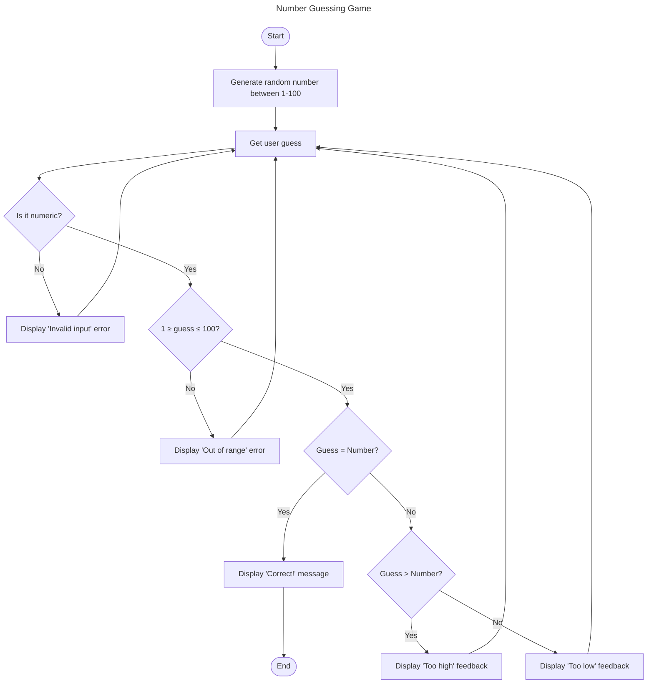

The *Number Guessing Game* begins with the program generating a random number within the specified range of 1 to 100. The player is asked to guess the number. The program checks if the input is numeric; if not it displays an **"Invalid input"** error and asks the player to guess again. If the input is numeric, the program checks to see if it is within the allowed range. If the guess is out of range, an **"Out of range"** error message is shown and the player is asked to try again.  

If the guess is valid and within range, the program compares the guess to the program's number. If the guess matches, the program congratulates the player with a **"Correct"** message and ends the game. If the guess does not match, the program determines whether the guess is too high or too low and provides **"Too high"** or **"Too low"** feedback and prompts the player to guess again. This repeats until the player correctly guesses the program's number.
